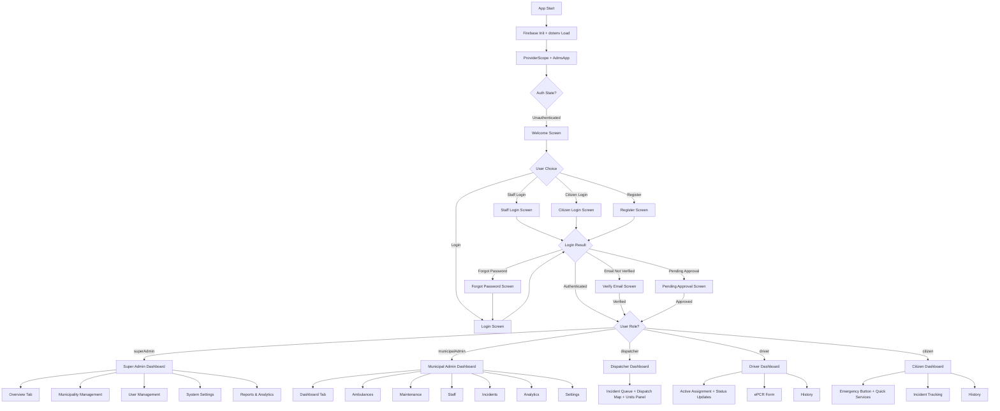
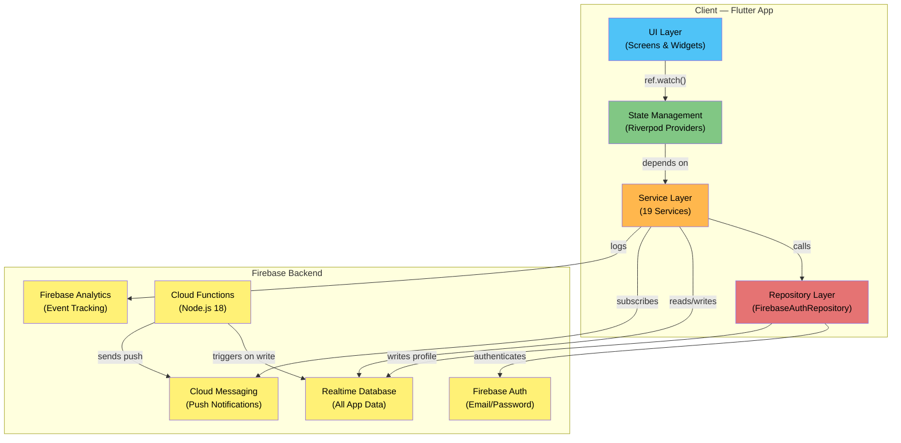

# 🚑 Ambulance Dispatch Management System (ADMS)

> A multi-role, real-time Computer-Aided Dispatch (CAD) platform built with Flutter and Firebase, designed to streamline emergency medical response operations for Local Government Units (LGUs) and emergency services providers.

[](LICENSE)
[](https://flutter.dev)
[](https://firebase.google.com)
[]()
[]()
[]()

---

## 📖 Project Overview

**ADMS** is a cross-platform Flutter application that provides a unified, role-specific interface for every actor in the emergency medical response chain:

- **Dispatchers** manage an incident queue and dispatch ambulance units from a real-time web command center
- **Ambulance crews** receive assignments and update mission status from a mobile-optimized dashboard
- **Citizens** request emergency assistance and track response progress in real time
- **Municipal admins** oversee their fleet, staff, and operations analytics
- **Super admins** manage the entire platform across all municipalities

All dashboards are powered by live **Firebase Realtime Database** streams — any status change made by one role is reflected instantly to all other connected parties with no polling or manual refresh. Offline persistence ensures queued writes sync automatically when connectivity is restored.

---

## 📌 Project Status

**🔧 In Development — MVP Complete**

The core architecture, authentication system, data models, 19-service layer, Cloud Functions backend, and all role-specific dashboards are fully implemented and connected to live Firebase services.

| Module | Status |
|---|---|
| Firebase Authentication (login, register, verify, approve) | ✅ Complete |
| Role-based routing & navigation guards (GoRouter) | ✅ Complete |
| Incident lifecycle management (9-step status tracking) | ✅ Complete |
| Ambulance unit management (CRUD + real-time streams) | ✅ Complete |
| Dispatch workflow (full 7-step atomic lifecycle) | ✅ Complete |
| Municipality management (CRUD — Super Admin) | ✅ Complete |
| FCM Push Notifications (topic-based subscriptions) | ✅ Complete |
| Firebase Analytics event tracking | ✅ Complete |
| Offline persistence & connectivity monitoring | ✅ Complete |
| Dispatcher Dashboard (3-panel, real-time Firebase) | ✅ Complete |
| Driver Dashboard (mobile-optimized + ePCR form) | ✅ Complete |
| Citizen Dashboard (emergency request + tracking) | ✅ Complete |
| Municipal Admin Dashboard (7-tab responsive sidebar) | ✅ Complete |
| Super Admin Dashboard (5-section system management) | ✅ Complete |
| Auth screens (welcome, login, register, forgot, verify, pending, staff login) | ✅ Complete |
| Live Dispatch Map (flutter_map + Mapbox tiles) | ✅ Complete |
| User Management (approve/deactivate/search/role-filter) | ✅ Complete |
| Reports & Analytics (fl_chart bar/pie charts) | ✅ Complete |
| System Settings (persisted to RTDB `/systemConfig`) | ✅ Complete |
| Maintenance scheduling & tracking | ✅ Complete |
| Electronic Patient Care Reporting (ePCR) | ✅ Complete |
| Response time analytics engine | ✅ Complete |
| Audit logging service | ✅ Complete |
| PDF/CSV export service | ✅ Complete |
| Auto-logout idle timer | ✅ Complete |
| GPS location tracking & distance calculations | ✅ Complete |
| Cloud Functions (auto-dispatch, FCM, audit, cleanup) | ✅ Complete |
| Model-level unit tests | ✅ Complete |
| Widget & integration tests | ✅ Complete |

---

## ✨ Features

### 🔐 Authentication & Account Lifecycle
- Email/password sign-in and registration via **Firebase Authentication**
- Email verification flow with dedicated screen and resend capability
- Account approval workflow — staff roles (dispatcher, driver) are held in a `pending` state with a dedicated waiting screen
- Deactivated account detection with automatic sign-out
- Password reset via email link
- Persistent session management via Firebase Auth state streams
- Auto-logout after configurable idle timeout (`IdleTimerService`)

### 👥 Role-Based Access Control (RBAC)
Five distinct user roles, each with isolated navigation and data access:

| Role | Platform | Responsibilities |
|---|---|---|
| `superAdmin` | Web | Full system access — manages municipalities, users, settings, reports |
| `municipalAdmin` | Web | Manages dispatchers, units, maintenance, staff, and analytics for their municipality |
| `dispatcher` | Web/Desktop | Receives incidents, acknowledges, assigns units, monitors real-time queue |
| `driver` | Mobile | Receives dispatch assignments, updates mission status, fills ePCR forms |
| `citizen` | Mobile | Requests emergency assistance, tracks response status in real time |

### 🚨 Incident Management
- Citizens create emergency requests with severity levels: `critical`, `urgent`, `normal`
- Full 9-status lifecycle: `pending → acknowledged → dispatched → enRoute → onScene → transporting → atHospital → resolved / cancelled`
- Real-time incident streams scoped per municipality
- Per-reporter and per-driver incident history streams
- Incident cross-referencing via index nodes (`/user_incidents/`, `/incident_index/`)

### 🚑 Ambulance Unit Management
- Full CRUD for ambulance units scoped per municipality
- Four unit types: **ALS** (Advanced Life Support), **BLS** (Basic Life Support), **MICU** (Mobile ICU), **Rescue**
- Six unit statuses: `available`, `enRoute`, `onScene`, `transporting`, `atHospital`, `outOfService`
- Real-time GPS location tracking with distance calculations (`LocationService`)
- Driver-to-unit binding via `/driver_units/{driverUid}` RTDB node

### 📡 Dispatch Workflow
End-to-end orchestration handled by `DispatchService` with **atomic multi-path RTDB updates**:

1. **Citizen reports** → incident created (`pending`)
2. **Dispatcher acknowledges** → incident (`acknowledged`), dispatcher assigned
3. **Dispatcher dispatches unit** → incident (`dispatched`) + unit (`enRoute`) + driver bound — single atomic write
4. **Driver arrives** → incident (`onScene`) + unit (`onScene`)
5. **Driver transports patient** → incident (`transporting`) + unit (`transporting`)
6. **Driver at hospital** → incident (`atHospital`) + unit (`atHospital`)
7. **Mission complete** → incident (`resolved`) + unit (`available`) — unit released back to pool

Auto-dispatch via Cloud Function (`onIncidentCreated`): when enabled in system config, automatically assigns the nearest available unit using haversine distance calculation.

### 🏛️ Municipality Management
- Full CRUD for municipality records via Super Admin
- Activate/deactivate municipalities
- Denormalized statistics (total units, active units, total dispatchers, total drivers)
- All data (incidents, units, maintenance, staff) scoped under municipality ID

### 🔧 Maintenance Scheduling
- Schedule preventive, corrective, inspection, and equipment maintenance
- Track maintenance status: `scheduled → inProgress → completed / overdue / cancelled`
- Record mileage, cost, parts replaced, technician notes
- Watch upcoming maintenance and per-unit service history
- Units automatically ineligible for dispatch while in maintenance

### 📋 Electronic Patient Care Reporting (ePCR)
- Drivers fill ePCR forms via `EpcrFormScreen`
- Captures: patient demographics, chief complaint, allergies, medications, medical history
- Vital signs: blood pressure, heart rate, respiratory rate, SpO2, temperature
- Treatment log and medications administered
- Hospital handover with receiving staff name and handover time
- Reports watchable per incident and per municipality

### 📊 Response Time Analytics
`ResponseTimeAnalytics` service computes:
- **Call processing time** (created → acknowledged)
- **Travel time** (dispatched → on scene)
- **On-scene time** (on scene → transporting)
- **Transport time** (transporting → at hospital)
- **Hospital turnaround** (at hospital → resolved)
- **Total response time** (created → resolved)

### 🔔 Push Notifications (FCM)
Topic-based subscription model via Firebase Cloud Messaging:

| Topic Pattern | Audience |
|---|---|
| `municipality_{id}` | All users in a municipality |
| `municipality_{id}_dispatchers` | Dispatcher-only alerts |
| `municipality_{id}_drivers` | Driver dispatch assignments |
| `municipality_{id}_admin` | Admin notifications |
| `incident_{municipalityId}_{incidentId}` | Per-incident status updates |
| `global_announcements` | System-wide broadcast |

Cloud Function `onUnitDispatched` triggers FCM push to the assigned driver when a unit status changes to `enRoute`.

### 📈 Analytics & Reporting
- Firebase Analytics integration for event logging (auth, incident, dispatch, navigation)
- `fl_chart` bar and pie charts on admin dashboards
- PDF report generation (`pdf` + `printing` packages)
- CSV data export for incidents and units
- Multi-municipality comparison charts for Super Admin

### 🔍 Audit Logging
- `AuditService` records all sensitive actions with timestamps
- Tracks: action type, performing user, target entity, details
- Cloud Function `onUserRoleChanged` auto-logs role changes
- Watchable audit log stream

### 🎨 UI & Theming
- **Material 3** light and dark themes (`AppTheme`)
- Emergency-service color system: severity, unit status, and role-specific palettes (`AppColors`)
- Custom typography: **Inter** (body) and **Plus Jakarta Sans** (headings) via `google_fonts`
- Animated transitions via `flutter_animate`
- Responsive layouts across all dashboards (mobile, tablet, desktop breakpoints)
- Theme persistence via `SharedPreferences` (`ThemeModeNotifier`)
- Offline banner when connectivity is lost

### 🌐 Offline-First Architecture
- Firebase RTDB offline persistence enabled (10 MB cache on mobile)
- `ConnectivityService` monitors network status with real-time stream
- Writes queue locally and auto-sync when reconnected
- Offline banner displayed in the app shell when disconnected

---

## 🗺️ App Flowchart



---

## 🏗️ System Architecture



---

## 🗄️ Firebase ERD (Database Schema)

```mermaid
erDiagram
    USERS {
        string id PK
        string email
        string firstName
        string lastName
        string phoneNumber
        string role "superAdmin | municipalAdmin | dispatcher | driver | citizen"
        string municipalityId FK
        string avatarUrl
        boolean isVerified
        boolean isActive
        boolean isApproved
        string fcmToken
        int createdAt
        int lastLoginAt
    }

    MUNICIPALITIES {
        string id PK
        string name
        string province
        string region
        string contactNumber
        string email
        double centerLatitude
        double centerLongitude
        string adminUid FK
        string emergencyHotline
        int totalUnits
        int activeUnits
        int totalDispatchers
        int totalDrivers
        boolean isActive
        int createdAt
    }

    INCIDENTS {
        string id PK
        string municipalityId FK
        string description
        string severity "critical | urgent | normal"
        string status "pending | acknowledged | dispatched | enRoute | onScene | transporting | atHospital | resolved | cancelled"
        string incidentType
        double latitude
        double longitude
        string address
        string reporterId FK
        string assignedUnitId FK
        string assignedDriverId FK
        string dispatcherId FK
        string destinationHospitalId
        string patientName
        int patientAge
        string patientCondition
        int createdAt
        int acknowledgedAt
        int dispatchedAt
        int enRouteAt
        int onSceneAt
        int transportingAt
        int atHospitalAt
        int resolvedAt
        int cancelledAt
    }

    AMBULANCE_UNITS {
        string id PK
        string municipalityId FK
        string callSign
        string plateNumber
        string type "als | bls | micu | rescue"
        string status "available | enRoute | onScene | transporting | atHospital | outOfService"
        string assignedDriverId FK
        string currentIncidentId FK
        double latitude
        double longitude
        int locationUpdatedAt
        boolean isActive
        int createdAt
        int lastStatusChangeAt
    }

    PATIENT_REPORTS {
        string id PK
        string incidentId FK
        string unitId FK
        string createdByUid FK
        string createdByName
        string patientFirstName
        string patientLastName
        int patientAge
        string patientGender
        string chiefComplaint
        string allergies
        string medications
        string pastMedicalHistory
        string vitals_bp
        int vitals_hr
        int vitals_rr
        int vitals_spo2
        double vitals_temp
        string treatments
        string medicationsGiven
        string destinationHospitalId
        string receivingStaffName
        int handoverTime
        int createdAt
        int updatedAt
    }

    MAINTENANCE {
        string id PK
        string unitId FK
        string unitCallSign
        string type "preventive | corrective | inspection | equipment"
        string status "scheduled | inProgress | completed | overdue | cancelled"
        string description
        int mileageAtService
        int nextServiceMileage
        int scheduledDate
        int completedDate
        int estimatedReturnDate
        double cost
        string performedBy
        string notes
        string partsReplaced
        int createdAt
    }

    SYSTEM_CONFIG {
        boolean pushNotificationsEnabled
        boolean smsAlertsEnabled
        boolean autoDispatchEnabled
        int responseTimeThresholdMinutes
        boolean requireAdminApproval
        int sessionTimeoutMinutes
        int updatedAt
        string updatedByUid FK
    }

    AUDIT_LOG {
        string id PK
        string action
        string performedByUid FK
        string performedByName
        string targetId
        string targetType
        string details
        int timestamp
    }

    MUNICIPALITIES ||--o{ USERS : "employs"
    MUNICIPALITIES ||--o{ INCIDENTS : "contains"
    MUNICIPALITIES ||--o{ AMBULANCE_UNITS : "owns"
    MUNICIPALITIES ||--o{ MAINTENANCE : "schedules"
    MUNICIPALITIES ||--o{ PATIENT_REPORTS : "generates"
    USERS ||--o{ INCIDENTS : "reports"
    USERS ||--o| AMBULANCE_UNITS : "drives"
    INCIDENTS ||--o| AMBULANCE_UNITS : "assigned to"
    INCIDENTS ||--o{ PATIENT_REPORTS : "documented by"
    AMBULANCE_UNITS ||--o{ MAINTENANCE : "serviced by"
```



**Additional Index Nodes:**

| Node | Path | Purpose |
|---|---|---|
| User Incidents | `/user_incidents/{reporterUid}/{incidentId}` | Fast lookup of citizen's own incidents |
| Driver Units | `/driver_units/{driverUid}` | Maps driver → assigned unit (`municipalityId/unitId`) |
| Incident Index | `/incident_index/{incidentId}` | Maps incident → municipality for cross-reference |

---

## 🛠️ Tech Stack

### Frontend (Flutter)

| Category | Technology | Version |
|---|---|---|
| Framework | Flutter (Dart) | SDK `^3.9.0` |
| State Management | Flutter Riverpod | `^2.6.1` |
| Routing | GoRouter | `^17.1.0` |
| Maps | flutter_map + Mapbox tiles | `^7.0.2` |
| Charts | fl_chart | `^0.69.0` |
| Animations | flutter_animate | `^4.5.2` |
| Fonts | google_fonts | `^8.0.2` |
| Geolocation | geolocator | `^14.0.0` |
| Coordinates | latlong2 | `^0.9.1` |
| Connectivity | connectivity_plus | `^7.0.0` |
| PDF Generation | pdf + printing | `^3.11.1` / `^5.13.4` |
| CSV Export | csv | `^6.0.0` |
| Value Equality | equatable | `^2.0.7` |
| UUID | uuid | `^4.5.1` |
| i18n / Formatting | intl | `^0.20.2` |
| Environment Config | flutter_dotenv | `^6.0.0` |
| Local Storage | shared_preferences | `^2.3.4` |
| File Paths | path_provider | `^2.1.5` |
| URL Launcher | url_launcher | `^6.3.1` |
| App Info | package_info_plus | `^8.1.3` |

### Backend (Firebase — Serverless)

| Service | Package | Version |
|---|---|---|
| Firebase Core | firebase_core | `^4.4.0` |
| Authentication | firebase_auth | `^6.1.4` |
| Realtime Database | firebase_database | `^12.1.3` |
| Cloud Messaging | firebase_messaging | `^16.1.1` |
| Analytics | firebase_analytics | `^12.1.2` |
| Cloud Functions | Node.js 18 | firebase-functions `^6.x` |

### Development & Testing

| Tool | Package | Version |
|---|---|---|
| Testing | flutter_test | SDK |
| Integration Tests | integration_test | SDK |
| Mocking | mockito | `^5.4.6` |
| Code Generation | build_runner | `^2.4.15` |
| Linting | flutter_lints | `^6.0.0` |

> The live dispatch map uses `flutter_map` with Mapbox vector tiles. A Mapbox access token in `.env` (key `MAPBOX_ACCESS_TOKEN`) enables Mapbox rendering; without it the map falls back to OpenStreetMap Humanitarian tiles automatically.

---

## ⚙️ Installation & Setup

### Prerequisites

| Requirement | Notes |
|---|---|
| Flutter SDK | Dart `^3.9.0` compatible |
| Firebase CLI | [Install](https://firebase.google.com/docs/cli) |
| FlutterFire CLI | `dart pub global activate flutterfire_cli` |
| Node.js 18+ | For Cloud Functions deployment |
| Git | Any recent version |

**Platform-specific:**
- **Android**: Android SDK + Android Studio
- **iOS** (macOS only): Xcode 14+, CocoaPods
- **Windows**: Visual Studio 2022 with "Desktop development with C++"
- **Linux**: Required development libraries (see [Flutter docs](https://docs.flutter.dev/get-started/install/linux/desktop))
- **macOS**: Xcode 14+

### 1. Clone the Repository

```bash
git clone https://github.com/qppd/ambulance-dispatch-management-system.git
cd ambulance-dispatch-management-system/source/flutter/adms
```

### 2. Install Flutter Dependencies

```bash
flutter pub get
```

### 3. Configure Firebase

**a)** Create a Firebase project at [console.firebase.google.com](https://console.firebase.google.com)

**b)** Enable the following services:
- **Authentication** → Email/Password provider
- **Realtime Database** → Create database (choose region)
- **Cloud Messaging** (enabled by default)
- **Analytics** (optional)

**c)** Run FlutterFire CLI to generate platform configs:

```bash
flutterfire configure --project=your-firebase-project-id
```

This generates `lib/firebase_options.dart`. A template is provided at `lib/firebase_options_template.dart` for reference.

**d)** Deploy Realtime Database security rules:

```bash
firebase deploy --only database
```

Rules file: `source/flutter/adms/database.rules.json`

### 4. Deploy Cloud Functions

```bash
cd functions
npm install
firebase deploy --only functions
```

### 5. Environment Variables

Create a `.env` file in `source/flutter/adms/`:

```env
MAPBOX_ACCESS_TOKEN=your_mapbox_access_token_here
```

The Mapbox token enables high-quality map tiles. Without it, the map falls back to OpenStreetMap tiles.

> **Do not commit `.env` to version control.** It is listed in `.gitignore`.

### 6. Seed Initial Super Admin

After registering via the app:
1. Open Firebase Console → Realtime Database → `/users/{uid}`
2. Set `"role": "superAdmin"`, `"isApproved": true`, `"isActive": true`

This user can then approve all subsequent staff registrations through the app.

---

## 📁 Project Structure

```
ambulance-dispatch-management-system/
├── README.md
├── LICENSE
├── DESIGN_GUIDELINES.md
├── firebase.json                            # Firebase hosting, functions, emulators config
├── diagrams/                                # Architecture and flow diagrams
│
├── functions/                               # Firebase Cloud Functions (Node.js 18)
│   ├── index.js                             # Entry point — exports all functions
│   ├── dispatch.js                          # Auto-dispatch nearest unit on incident create
│   ├── notifications.js                     # FCM push on unit status change
│   ├── audit.js                             # Audit log on user role change
│   ├── invites.js                           # Cleanup expired invite links (scheduled)
│   └── package.json
│
└── source/flutter/adms/                     # Flutter application root
    ├── pubspec.yaml
    ├── analysis_options.yaml
    ├── database.rules.json                  # Firebase RTDB security rules
    ├── .env.example                         # Environment template
    │
    ├── lib/
    │   ├── main.dart                        # Entry point: Firebase init, Riverpod, theme, router
    │   ├── firebase_options.dart            # Generated by FlutterFire CLI (gitignored)
    │   ├── firebase_options_template.dart   # Reference template
    │   │
    │   ├── core/
    │   │   ├── data/repositories/
    │   │   │   ├── auth_repository.dart             # Abstract auth interface
    │   │   │   └── firebase_auth_repository.dart    # Firebase Auth + RTDB implementation
    │   │   │
    │   │   ├── models/
    │   │   │   ├── user.dart                        # User model (profile, role, approval)
    │   │   │   ├── user_role.dart                   # Enum: superAdmin, municipalAdmin, dispatcher, driver, citizen
    │   │   │   ├── auth_state.dart                  # Sealed class: auth lifecycle states
    │   │   │   ├── incident.dart                    # Incident + IncidentSeverity + IncidentStatus
    │   │   │   ├── ambulance_unit.dart              # AmbulanceUnit + UnitType + UnitStatus
    │   │   │   ├── municipality.dart                # Municipality with denormalized stats
    │   │   │   ├── patient_care_report.dart         # ePCR: demographics, vitals, treatments
    │   │   │   ├── maintenance_record.dart          # Maintenance scheduling and tracking
    │   │   │   └── system_config.dart               # Global system settings
    │   │   │
    │   │   ├── router/
    │   │   │   └── app_router.dart                  # GoRouter with auth guards + role redirects
    │   │   │
    │   │   ├── services/
    │   │   │   ├── auth_service.dart                # AuthNotifier, login, register, logout
    │   │   │   ├── incident_service.dart            # Incident CRUD + real-time streams
    │   │   │   ├── dispatch_service.dart            # 7-step dispatch workflow (atomic writes)
    │   │   │   ├── unit_service.dart                # Unit CRUD, location tracking, driver binding
    │   │   │   ├── user_service.dart                # User streams, approve/deactivate
    │   │   │   ├── municipality_service.dart        # Municipality CRUD + streams
    │   │   │   ├── notification_service.dart        # FCM init, topics, token management
    │   │   │   ├── location_service.dart            # GPS tracking, permissions, distance calc
    │   │   │   ├── connectivity_service.dart        # Network status, offline persistence
    │   │   │   ├── analytics_service.dart           # Firebase Analytics event logging
    │   │   │   ├── export_service.dart              # PDF/CSV generation
    │   │   │   ├── audit_service.dart               # Audit log management
    │   │   │   ├── idle_timer_service.dart          # Auto-logout after inactivity
    │   │   │   ├── maintenance_service.dart         # Maintenance scheduling + tracking
    │   │   │   ├── patient_care_report_service.dart # ePCR CRUD + streams
    │   │   │   ├── response_time_analytics.dart     # Response time metric calculations
    │   │   │   ├── system_config_service.dart       # Global config persistence
    │   │   │   └── theme_service.dart               # Light/dark/system theme toggle
    │   │   │
    │   │   └── theme/
    │   │       ├── app_theme.dart                   # Material 3 light + dark themes
    │   │       ├── app_colors.dart                  # Brand, emergency, unit, role colors + gradients
    │   │       └── app_typography.dart              # Inter (body), Plus Jakarta Sans (headings)
    │   │
    │   ├── features/
    │   │   ├── auth/screens/
    │   │   │   ├── welcome_screen.dart              # Role selection entry point
    │   │   │   ├── login_screen.dart                # Email/password (role-adaptive)
    │   │   │   ├── register_screen.dart             # Account creation
    │   │   │   ├── staff_login_screen.dart          # Staff-specific entry
    │   │   │   ├── forgot_password_screen.dart      # Password reset
    │   │   │   ├── verify_email_screen.dart         # Email verification + resend
    │   │   │   └── pending_approval_screen.dart     # Admin approval wait
    │   │   │
    │   │   ├── citizen/screens/
    │   │   │   ├── citizen_dashboard.dart           # Emergency button + history + profile
    │   │   │   ├── citizen_login_screen.dart        # Citizen-specific login
    │   │   │   └── incident_tracking_screen.dart    # Real-time incident status
    │   │   │
    │   │   ├── dispatcher/screens/
    │   │   │   └── dispatcher_dashboard.dart        # 3-panel: queue + map + units
    │   │   │
    │   │   ├── driver/screens/
    │   │   │   ├── driver_dashboard.dart            # Status updates + assignment + nav
    │   │   │   └── epcr_form_screen.dart            # Electronic patient care report
    │   │   │
    │   │   ├── municipal_admin/screens/
    │   │   │   ├── municipal_admin_dashboard.dart   # Navigation shell (sidebar/drawer)
    │   │   │   ├── dashboard_tab.dart               # KPI overview + charts
    │   │   │   ├── ambulances_screen.dart           # Unit CRUD + status
    │   │   │   ├── maintenance_screen.dart          # Maintenance schedule + records
    │   │   │   ├── staff_screen.dart                # Dispatcher/driver management
    │   │   │   ├── incidents_screen.dart            # Incident queue + history
    │   │   │   ├── analytics_screen.dart            # Response time + utilization charts
    │   │   │   └── settings_screen.dart             # Municipality config
    │   │   │
    │   │   └── super_admin/screens/
    │   │       ├── super_admin_dashboard.dart       # Navigation shell (sidebar)
    │   │       ├── super_admin_overview_tab.dart    # System-wide KPIs
    │   │       ├── municipality_management_screen.dart
    │   │       ├── user_management_screen.dart      # Approve/deactivate/search/filter
    │   │       ├── system_settings_screen.dart      # Global config toggles
    │   │       └── reports_screen.dart              # Multi-municipality analytics
    │   │
    │   └── shared/widgets/
    │       ├── common_widgets.dart                  # AppTextField, AppButton, AppCheckbox
    │       ├── dispatch_map.dart                    # flutter_map + Mapbox/OSM tiles
    │       └── responsive_layout.dart               # Breakpoint-aware layout helpers
    │
    ├── test/
    │   ├── widget_test.dart                         # App smoke test
    │   ├── models/
    │   │   ├── user_test.dart
    │   │   ├── incident_test.dart
    │   │   ├── ambulance_unit_test.dart
    │   │   └── maintenance_record_test.dart
    │   ├── services/
    │   │   └── system_config_notifier_test.dart
    │   └── widgets/
    │       ├── system_settings_widget_test.dart
    │       ├── user_management_widget_test.dart
    │       └── dispatch_map_widget_test.dart
    │
    └── integration_test/
        └── dispatch_lifecycle_test.dart             # Full dispatch lifecycle E2E
```

---

## 🧩 Architecture Overview

### Pattern
Feature-first **Clean Architecture** with a service layer and repository pattern, powered by **Riverpod** for reactive state management.

### Layer Diagram

| Layer | Responsibility |
|---|---|
| **UI** (Screens & Widgets) | Renders role-specific dashboards, consumes providers via `ref.watch()` |
| **State** (Riverpod Providers) | `StateNotifierProvider` for auth, `StreamProvider.family` for real-time data |
| **Services** (19 services) | Encapsulate all business logic and Firebase interactions |
| **Repositories** | Abstract interfaces with Firebase implementations (auth) |
| **Firebase SDK** | Auth, RTDB, FCM, Analytics — direct connection to backend |

### Role-Based Navigation (GoRouter)

`GoRouter` with a reactive `redirect` callback tied to `AuthState`:

| Condition | Redirect Target |
|---|---|
| Unauthenticated | `/` (Welcome screen) |
| Email not verified | `/verify-email` |
| Pending approval | `/pending-approval` |
| Authenticated | Role-specific home (`/super-admin`, `/municipal-admin`, `/dispatcher`, `/driver`, `/citizen`) |
| Wrong role for route | Redirected back to own role home |

**Route Map:**

| Route | Screen | Access |
|---|---|---|
| `/` | WelcomeScreen | Public |
| `/login` | LoginScreen | Public |
| `/register` | RegisterScreen | Public |
| `/staff-login` | StaffLoginScreen | Public |
| `/citizen/login` | CitizenLoginScreen | Public |
| `/forgot-password` | ForgotPasswordScreen | Public |
| `/verify-email` | VerifyEmailScreen | Authenticated (unverified) |
| `/pending-approval` | PendingApprovalScreen | Authenticated (pending) |
| `/super-admin` | SuperAdminDashboard | `superAdmin` |
| `/super-admin/municipalities` | MunicipalityManagementScreen | `superAdmin` |
| `/super-admin/users` | UserManagementScreen | `superAdmin` |
| `/super-admin/settings` | SystemSettingsScreen | `superAdmin` |
| `/super-admin/reports` | ReportsScreen | `superAdmin` |
| `/municipal-admin` | MunicipalAdminDashboard | `municipalAdmin` |
| `/dispatcher` | DispatcherDashboard | `dispatcher` |
| `/driver` | DriverDashboard | `driver` |
| `/citizen` | CitizenDashboard | `citizen` |
| `/citizen/track` | IncidentTrackingScreen | `citizen` |

---

## 🔄 State Management

### Approach: Riverpod 2.x with Sealed States

All app state flows through Riverpod providers. No manual `setState` calls for data updates.

**Sealed Auth States:**
```dart
sealed class AuthState extends Equatable { }
class AuthInitial extends AuthState { }
class AuthLoading extends AuthState { }
class AuthAuthenticated extends AuthState { final User user; }
class AuthUnauthenticated extends AuthState { }
class AuthError extends AuthState { final String message; }
class AuthPendingApproval extends AuthState { final User user; }
class AuthNotVerified extends AuthState { final User user; }
```

**Provider Types Used:**

| Pattern | Use Case | Example |
|---|---|---|
| `StateNotifierProvider` | Auth lifecycle, system config | `authStateProvider`, `systemConfigProvider` |
| `StreamProvider` | Real-time Firebase streams | `isOnlineProvider`, `auditLogProvider` |
| `StreamProvider.family` | Parameterized streams | `municipalityIncidentsProvider(municipalityId)` |
| `Provider` | Service singletons | `incidentServiceProvider`, `dispatchServiceProvider` |

**Reactive Data Flow:**
```
Widget → ref.watch(provider) → Service → Firebase RTDB Stream → Auto-rebuild
```

All Firebase data is exposed as `StreamProvider` or `StreamProvider.family`, so dashboards rebuild reactively on any RTDB change.

---

## 🔥 Firebase Integration

### Services Used

| Service | Purpose |
|---|---|
| **Firebase Auth** | Email/password authentication, email verification, password reset |
| **Realtime Database** | All app data — users, incidents, units, municipalities, maintenance, ePCR, config, audit |
| **Cloud Messaging** | Topic-based push notifications for dispatch and status alerts |
| **Analytics** | Event logging for auth, incident, dispatch, and navigation actions |
| **Cloud Functions** | Server-side auto-dispatch, FCM triggers, audit logging, invite cleanup |

### Realtime Database Node Map

```
/users/{uid}/                                    ← User profiles + roles + FCM tokens
/incidents/{municipalityId}/{incidentId}/         ← Incident records (9-step lifecycle)
/units/{municipalityId}/{unitId}/                 ← Ambulance units (GPS, status, driver)
/municipalities/{municipalityId}/                 ← Municipality records + stats
/maintenance/{municipalityId}/{maintenanceId}/    ← Maintenance scheduling records
/patient_reports/{municipalityId}/{reportId}/     ← ePCR records
/systemConfig/                                    ← Global settings (single node)
/auditLog/{entryId}/                              ← Action audit trail
/user_incidents/{reporterUid}/{incidentId}/       ← Reporter → incident index
/driver_units/{driverUid}/                        ← Driver → unit binding
/incident_index/{incidentId}/                     ← Incident → municipality lookup
```

### RTDB Security Rules

Role-based access control deployed from `database.rules.json`:

| Role | Permissions |
|---|---|
| **superAdmin** | Read/write all nodes across all municipalities |
| **municipalAdmin** | Read/write within own municipality |
| **dispatcher** | Read/write incidents and units in own municipality |
| **driver** | Read own assignments, write own unit status/location |
| **citizen** | Report incidents, read own incidents |

### Offline Persistence

```dart
// Enabled in main.dart (mobile only)
FirebaseDatabase.instance.setPersistenceEnabled(true);
FirebaseDatabase.instance.setPersistenceCacheSizeBytes(10 * 1024 * 1024); // 10 MB
```

Writes queue locally and auto-sync when connectivity is restored.

---

## ☁️ Cloud Functions

Firebase Cloud Functions (Node.js 18) handle server-side automation:

| Function | Trigger | Purpose |
|---|---|---|
| `onIncidentCreated` | `onCreate` on `/incidents/{municipalityId}/{incidentId}` | Auto-dispatch nearest available unit (haversine distance) when `autoDispatchEnabled` in system config |
| `onUnitDispatched` | `onUpdate` on `/units/{municipalityId}/{unitId}/status` | Send FCM push notification to assigned driver when status becomes `enRoute` |
| `onUserRoleChanged` | `onUpdate` on `/users/{uid}/role` | Log sensitive role change to `/auditLog` |
| `cleanupExpiredInvites` | Cloud Scheduler (daily) | Remove invite links older than 7 days |

### Deployment

```bash
cd functions
npm install
firebase deploy --only functions
```

---

## 🔌 API / Services Layer

All 19 services are exposed as Riverpod providers and encapsulate Firebase interactions:

| Service | Key Methods | Provider |
|---|---|---|
| **AuthService** | `login()`, `register()`, `logout()`, `sendEmailVerification()`, `sendPasswordReset()` | `authStateProvider` |
| **IncidentService** | `reportIncident()`, `createDispatcherIncident()`, `acknowledgeIncident()`, `watchActiveIncidents()`, `watchIncidentsByReporter()` | `incidentServiceProvider` |
| **DispatchService** | `dispatchUnit()`, `markEnRoute()`, `markArrivedAtScene()`, `startTransport()`, `markTransportComplete()`, `resolveIncident()`, `cancelIncident()` | `dispatchServiceProvider` |
| **UnitService** | `createUnit()`, `updateStatus()`, `updateLocation()`, `assignDriver()`, `watchUnits()`, `watchAvailableUnits()` | `unitServiceProvider` |
| **UserService** | `watchAllUsers()`, `watchUsersByRole()`, `approveUser()`, `deactivateUser()`, `reactivateUser()`, `saveFcmToken()` | `userServiceProvider` |
| **MunicipalityService** | `createMunicipality()`, `updateMunicipality()`, `deactivateMunicipality()`, `watchAllMunicipalities()` | `municipalityServiceProvider` |
| **NotificationService** | `initialize()`, `subscribeForUser()`, `subscribeToIncident()`, `unsubscribeAll()` | `notificationServiceProvider` |
| **LocationService** | `getCurrentPosition()`, `watchPosition()`, `distanceBetween()`, `distanceInKm()`, `estimateTravelTimeMinutes()` | `locationServiceProvider` |
| **ConnectivityService** | `isConnected()`, `watchConnectivity()`, `enableOfflinePersistence()` | `isOnlineProvider` |
| **AnalyticsService** | `setUser()`, `logLogin()`, `logIncidentCreated()`, `logDispatch()` | `analyticsServiceProvider` |
| **ExportService** | `printIncidentsPdf()`, `incidentsToCsv()`, `printUnitsPdf()`, `unitsToCsv()` | `exportServiceProvider` |
| **AuditService** | `log()`, `watchAuditLog()` | `auditServiceProvider` |
| **IdleTimerService** | `resetTimer()`, `stopTimer()`, `handleUserInteraction()` | `idleTimerServiceProvider` |
| **MaintenanceService** | `scheduleMaintenance()`, `markInProgress()`, `markCompleted()`, `watchMaintenanceRecords()` | `maintenanceServiceProvider` |
| **PatientCareReportService** | `createReport()`, `updateVitals()`, `updateTreatments()`, `completeReport()`, `watchAllReports()` | `patientCareReportServiceProvider` |
| **ResponseTimeAnalytics** | `callProcessingMinutes()`, `travelTimeMinutes()`, `onSceneTimeMinutes()`, `transportTimeMinutes()`, `totalResponseTimeMinutes()` | `responseTimeAnalyticsProvider` |
| **SystemConfigService** | `watchSystemConfig()`, `saveSystemConfig()`, `updateFlag()`, `updateInt()` | `systemConfigServiceProvider` |
| **ThemeService** | `setThemeMode()`, `toggle()` | `themeModeProvider` |

---

## 🔐 Environment Variables

| Variable | Required | Purpose |
|---|---|---|
| `MAPBOX_ACCESS_TOKEN` | Optional | Enables Mapbox map tiles. Falls back to OpenStreetMap if not provided. |

Environment variables are loaded from `.env` in the Flutter app root via `flutter_dotenv`. The file is loaded with `isOptional: true`, so the app runs without it.

Firebase credentials are managed separately via `firebase_options.dart` (auto-generated by `flutterfire configure`).

### Firebase Emulator Support

The project includes emulator configuration in `firebase.json`:

| Emulator | Port |
|---|---|
| Auth | 9099 |
| Realtime Database | 9000 |
| Cloud Functions | 5001 |
| Hosting | 5000 |
| Emulator UI | Auto |

```bash
firebase emulators:start
```

---

## 🚀 Running the Application

### Development

```bash
# Web (recommended for dispatcher/admin roles)
flutter run -d chrome

# Android (recommended for driver/citizen roles)
flutter run -d android

# iOS (macOS only)
flutter run -d ios

# Windows / macOS / Linux Desktop
flutter run -d windows
flutter run -d macos
flutter run -d linux
```

### Build & Deployment

```bash
# Web (deployed via Firebase Hosting)
flutter build web --release
firebase deploy --only hosting

# Android
flutter build apk --release
flutter build appbundle --release

# iOS (macOS only)
flutter build ios --release

# Desktop
flutter build windows --release
flutter build macos --release
flutter build linux --release
```

Firebase Hosting is configured to serve from `source/flutter/adms/build/web` with SPA rewrites.

---

## 🧪 Testing

### Test Coverage

| Test Category | Files | Scope |
|---|---|---|
| **Model Tests** | `user_test.dart`, `incident_test.dart`, `ambulance_unit_test.dart`, `maintenance_record_test.dart` | Serialization/deserialization, equality, enum mapping |
| **Service Tests** | `system_config_notifier_test.dart` | StateNotifier transitions, model round-trips |
| **Widget Tests** | `system_settings_widget_test.dart`, `user_management_widget_test.dart`, `dispatch_map_widget_test.dart` | UI rendering, form interactions, search/filter |
| **Integration Tests** | `dispatch_lifecycle_test.dart` | Full incident → dispatch → resolution lifecycle |
| **Smoke Test** | `widget_test.dart` | App renders welcome screen |

### Running Tests

```bash
# All unit + widget tests
flutter test

# Specific test file
flutter test test/models/incident_test.dart

# Integration tests (requires emulator or device)
flutter test integration_test/

# With coverage report
flutter test --coverage

# Generate mocks
dart run build_runner build
```

---

## 🗺️ Roadmap

### Engineering Foundations (50%)
- [x] Riverpod StateNotifier + StreamProvider conventions
- [x] Feature-first architecture with barrel files
- [x] Error handling strategy (Firebase error mapping, snackbar feedback)
- [ ] Adopt `flutter_lints` and enforce clean `flutter analyze`
- [ ] Pre-commit hooks for formatting (`dart format`)
- [ ] CI pipeline (`flutter analyze` + `flutter test` on PRs)

### UI/UX Foundations (50%)
- [x] Material 3 theme tokens (colors, typography, shapes)
- [x] Responsive layout system (mobile/tablet/desktop breakpoints)
- [ ] Accessibility baseline: contrast ≥ 4.5:1, touch targets ≥ 48×48
- [ ] Motion guidelines + reusable transition system

### Core Features — Planned
- [ ] Route visualization on dispatch map
- [ ] Location history playback
- [ ] Traffic-aware dispatching
- [ ] Crew and equipment monitoring
- [ ] Demand pattern forecasting (historical analysis)
- [ ] Geospatial incident heatmapping
- [ ] System Status Management (strategic unit positioning)
- [ ] Executive KPI dashboard for LGU officials
- [ ] Incident replay functionality
- [ ] Hospital management module (CRUD, capacity, transfers)

### Quality Gates
- [ ] Performance audit (DevTools profiling, rebuild analysis)
- [ ] Accessibility audit
- [ ] Release regression test suite

---

## 🤝 Contributing

1. **Fork** the repository
2. **Create** a feature branch: `git checkout -b feature/your-feature`
3. **Make changes** following [Effective Dart](https://dart.dev/guides/language/effective-dart) guidelines
4. **Test**: `flutter test && flutter analyze`
5. **Commit**: `git commit -m "Add feature: description"`
6. **Push**: `git push origin feature/your-feature`
7. **Submit** a Pull Request

### Code Review Checklist
- Code quality and style compliance
- Test coverage maintained or improved
- Documentation updated
- No security vulnerabilities
- Performance implications considered

---

## 📄 License

This project is licensed under the **MIT License** — see the [LICENSE](LICENSE) file for details.

---

## 🙏 Acknowledgments

- Local Government Units (LGUs) in the Philippines for real-world operational requirements
- Emergency Medical Technicians (EMTs) and Paramedics for field usability feedback
- Dispatchers for insights into emergency response coordination challenges
- The Flutter and Firebase communities for excellent frameworks and tooling

---

## 📬 Contact

**Developer**: qppd
**GitHub**: [@qppd](https://github.com/qppd)
**Repository**: [ambulance-dispatch-management-system](https://github.com/qppd/ambulance-dispatch-management-system)

- Open an [issue](https://github.com/qppd/ambulance-dispatch-management-system/issues)
- Submit a [pull request](https://github.com/qppd/ambulance-dispatch-management-system/pulls)
- Join [Discussions](https://github.com/qppd/ambulance-dispatch-management-system/discussions)

---

<div align="center">

**Built with ❤️ for emergency medical services providers**

*Making a difference, one dispatch at a time*

</div>