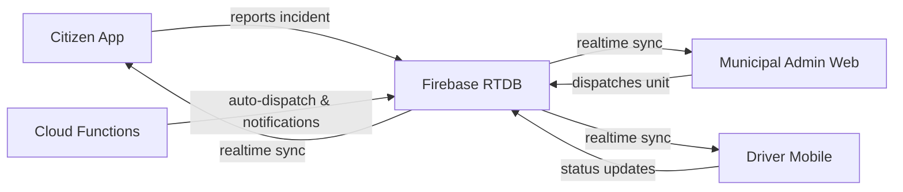

# ADMS — Ambulance Dispatch Management System

A real‑time emergency response platform for LGUs (Local Government Units). **ADMS** connects citizens, ambulance crews, and municipal administrators into a single dispatch workflow — from incident reporting to patient handover.



## Quick Start

```bash
# 1. Clone & install
git clone https://github.com/qppd/ambulance-dispatch-management-system
cd ambulance-dispatch-management-system/source/flutter/adms
flutter pub get

# 2. Set up Firebase
#    - Create a Firebase project at https://console.firebase.google.com
#    - Enable: Authentication (Email/Password), Realtime Database, Messaging, Analytics
#    - Place firebase_options.dart in lib/ (use firebase_options_template.dart as a guide)
#    - Deploy Cloud Functions:
cd ../../../functions
npm install
firebase deploy --only functions

# 3. Run
cd ../source/flutter/adms
flutter run
```

## Architecture Overview

| Layer | Technology | Purpose |
|-------|-----------|---------|
| **Frontend** | Flutter 3.x + Riverpod 3 | Cross‑platform mobile/web app |
| **Backend** | Firebase Realtime DB | Real‑time state & sync |
| **Cloud Functions** | Firebase Functions (Node 20) | Auto‑dispatch, notifications, audit |
| **Authentication** | Firebase Auth | Email/password, role‑based sessions |
| **Maps** | flutter_map + OpenStreetMap | Incident & unit location |

## User Roles

| Role | Access | Platform |
|------|--------|----------|
| **Super Admin** | Full system control | All platforms |
| **Municipal Admin** | Municipality ops + dispatch | Web |
| **Driver/Crew** | Incident response & ePCR | Mobile |
| **Citizen** | Report & track incidents | Mobile |

## Key Features

- **Incident Lifecycle** — `pending → acknowledged → dispatched → enRoute → onScene → transporting → atHospital → resolved`
- **Auto‑Dispatch** — Nearest‑unit assignment via Haversine distance engine (Cloud Function)
- **Push Notifications** — FCM topic‑based alerts for drivers & admins
- **Offline Support** — Firebase RTDB disk persistence for intermittent connectivity
- **Analytics** — Response time metrics, P90, compliance rates
- **ePCR** — Basic electronic Patient Care Report (demographics, vitals, treatments, handover)
- **Export** — PDF & CSV reports for incidents, units, and maintenance
- **Connectivity Monitoring** — Offline banner with automatic resync

## Project Structure

```
ambulance-dispatch-management-system/
├── README.md
├── docs/                          # Full documentation
│   ├── overview.md
│   ├── architecture.md
│   ├── setup-guide.md
│   ├── usage-guide.md
│   ├── api-reference.md
│   ├── functions.md
│   ├── data-flow.md
│   └── troubleshooting.md
├── functions/                     # Firebase Cloud Functions
│   ├── index.js                   # Function registry
│   ├── dispatch.js                # Auto-dispatch + status lifecycle
│   ├── notifications.js           # FCM push notifications
│   ├── invites.js                 # Expired invite cleanup
│   └── audit.js                   # Role change audit logging
└── source/flutter/adms/           # Flutter application
    ├── lib/
    │   ├── main.dart              # App entry point
    │   ├── core/
    │   │   ├── models/            # Data models (incident, user, unit, etc.)
    │   │   ├── services/          # Business logic services
    │   │   ├── router/            # GoRouter navigation
    │   │   ├── theme/             # App styling & colors
    │   │   └── data/repositories/ # Firebase auth repository
    │   └── features/
    │       ├── auth/              # Login, register, verification
    │       ├── citizen/           # Citizen dashboard & tracking
    │       ├── driver/            # Driver dashboard & ePCR
    │       ├── municipal_admin/   # Admin dashboard, units, incidents
    │       ├── super_admin/       # System config, user mgmt, reports
    │       └── shared/            # Shared widgets (map, layout)
    ├── database.rules.json        # Firebase RTDB security rules
    └── test/                      # Unit & widget tests
```

## Dependencies

- **Flutter** ≥3.9 — `flutter_riverpod`, `go_router`, `firebase_*`, `flutter_map`, `equatable`, `geolocator`, `csv`, `pdf`, `printing`
- **Node** ≥20 — `firebase-admin`, `firebase-functions`, `eslint`

## Author

**Sajed Lopez Mendoza**  
[github.com/qppd](https://github.com/qppd) | [facebook.com/qppd.dev](https://facebook.com/qppd.dev) | [sajed-lopez-mendoza.vercel.app](https://sajed-lopez-mendoza.vercel.app)