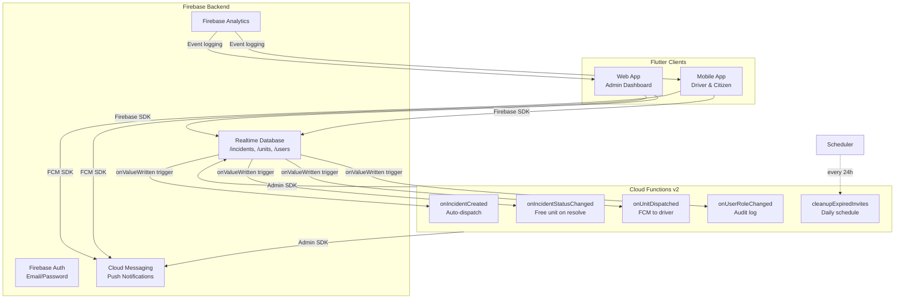

# Architecture

## System Design

ADMS follows a **client‑centric, serverless real‑time architecture**. All business logic lives in either the Flutter client or Firebase Cloud Functions. There is no custom REST API server — Firebase SDKs handle all data synchronisation.



## Component Breakdown

### 1. Flutter Frontend (`lib/`)

```
lib/
├── main.dart              # App entry — Firebase init, theme, router
├── core/
│   ├── models/            # Immutable data models (Equatable)
│   │   ├── user.dart            # User profile & permissions
│   │   ├── user_role.dart       # UserRole enum + extension
│   │   ├── auth_state.dart      # AuthState sealed class
│   │   ├── incident.dart        # Incident + enums
│   │   ├── ambulance_unit.dart  # Unit + enums
│   │   ├── municipality.dart    # LGU record
│   │   ├── system_config.dart   # System settings
│   │   ├── maintenance_record.dart
│   │   └── patient_care_report.dart
│   ├── services/          # Business logic (all services)
│   │   ├── auth_service.dart          # Riverpod Notifier
│   │   ├── incident_service.dart      # CRUD + streams
│   │   ├── dispatch_service.dart      # Dispatch workflow
│   │   ├── unit_service.dart          # Fleet management
│   │   ├── user_service.dart          # User management
│   │   ├── municipality_service.dart  # LGU management
│   │   ├── location_service.dart      # GPS tracking
│   │   ├── notification_service.dart  # FCM topics
│   │   ├── connectivity_service.dart  # Offline detection
│   │   ├── analytics_service.dart     # Firebase Analytics
│   │   ├── response_time_analytics.dart  # Metrics engine
│   │   ├── audit_service.dart         # Audit logging
│   │   ├── export_service.dart        # PDF/CSV generation
│   │   ├── maintenance_service.dart   # Fleet maintenance
│   │   ├── patient_care_report_service.dart
│   │   ├── idle_timer_service.dart    # Auto-logout
│   │   ├── system_config_service.dart # Config Notifier
│   │   └── theme_service.dart         # Theme mode Notifier
│   ├── router/            # GoRouter + auth redirects
│   └── theme/             # AppColors, AppTheme, AppTypography
├── features/
│   ├── auth/              # Welcome, login, register, verify
│   ├── citizen/           # Dashboard, incident tracking
│   ├── driver/            # Dashboard, ePCR form
│   ├── municipal_admin/   # Dashboard, incidents, units, staff
│   ├── super_admin/       # Dashboard, system settings, users
│   └── shared/            # DispatchMap, ResponsiveLayout, NotFound
└── shared/widgets/        # DispatchMap, ResponsiveLayout
```

### 2. Firebase Realtime Database

The database is organised into top‑level nodes, each scoped by `municipalityId` where applicable:

```
/
├── users/{uid}/              # User profiles
├── municipalities/{id}/      # LGU records
├── incidents/{municipalityId}/{incidentId}/
├── units/{municipalityId}/{unitId}/
├── maintenance/{municipalityId}/{id}/
├── patient_reports/{municipalityId}/{id}/
├── user_incidents/{uid}/{incidentId}: true  # Citizen index
├── incident_index/{incidentId}: municipalityId
├── driver_units/{uid}: {municipalityId}/{unitId}
├── driver_locations/{municipalityId}/{unitId}
├── invites/{token}/
├── auditLog/{entryId}/
├── systemConfig/
```

Security rules enforce role‑based access at every node (see `database.rules.json`).

### 3. Cloud Functions (`functions/`)

| Function | Trigger | Purpose |
|----------|---------|---------|
| `onIncidentCreated` | `/incidents/{municipalityId}/{incidentId}` — create | Auto‑dispatch nearest unit via atomic transaction |
| `onIncidentStatusChanged` | `/incidents/.../status` — write | Free unit when incident resolved |
| `onUnitDispatched` | `/units/.../status` — write to `enRoute` | Send FCM push to assigned driver |
| `onUserRoleChanged` | `/users/{uid}/role` — write | Log role change to audit trail |
| `cleanupExpiredInvites` | Scheduled (24h) | Remove unused invites older than 7 days |

### 4. Data Flow

```mermaid
sequenceDiagram
    participant C as Citizen App
    participant R as Firebase RTDB
    participant D as Cloud Functions
    participant A as Municipal Admin
    participant Dr as Driver App

    C->>R: reportIncident()
    Note over R,D: onIncidentCreated() fires
    D->>R: Find available units
    D->>R: claimUnitInTransaction()
    D->>R: Update incident → dispatched
    R-->>A: Real-time: new incident
    R-->>Dr: Real-time: dispatch assignment
    R-->>D: onUnitDispatched() fires
    D->>Dr: FCM push notification
    Dr->>R: markEnRoute()
    Dr->>R: markArrivedAtScene()
    Dr->>R: startTransport()
    Dr->>R: markTransportComplete()
    R-->>A: Real-time: status updates
    R-->>C: Real-time: tracking updates