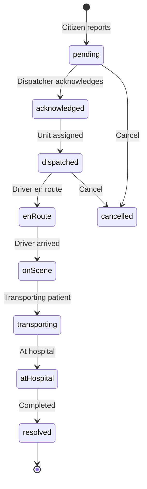
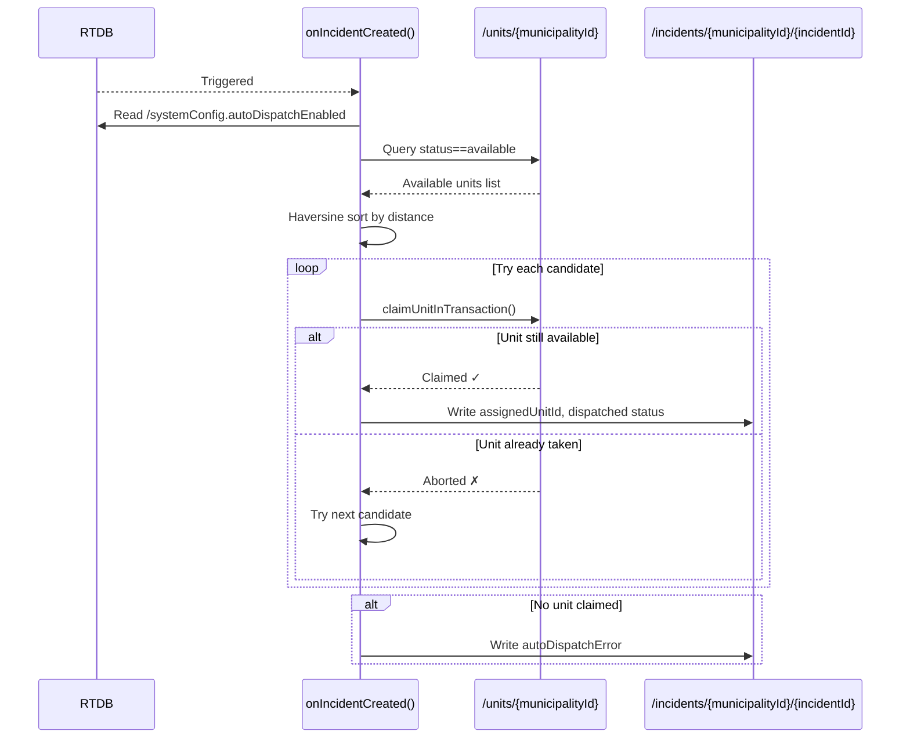
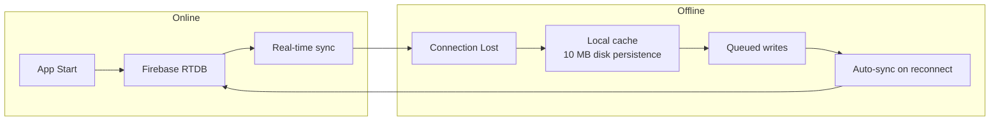
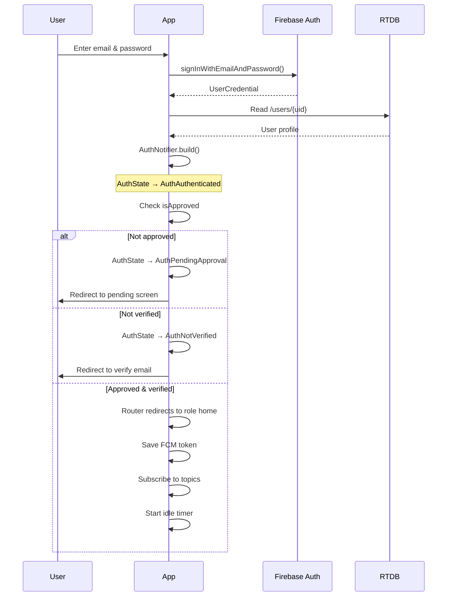
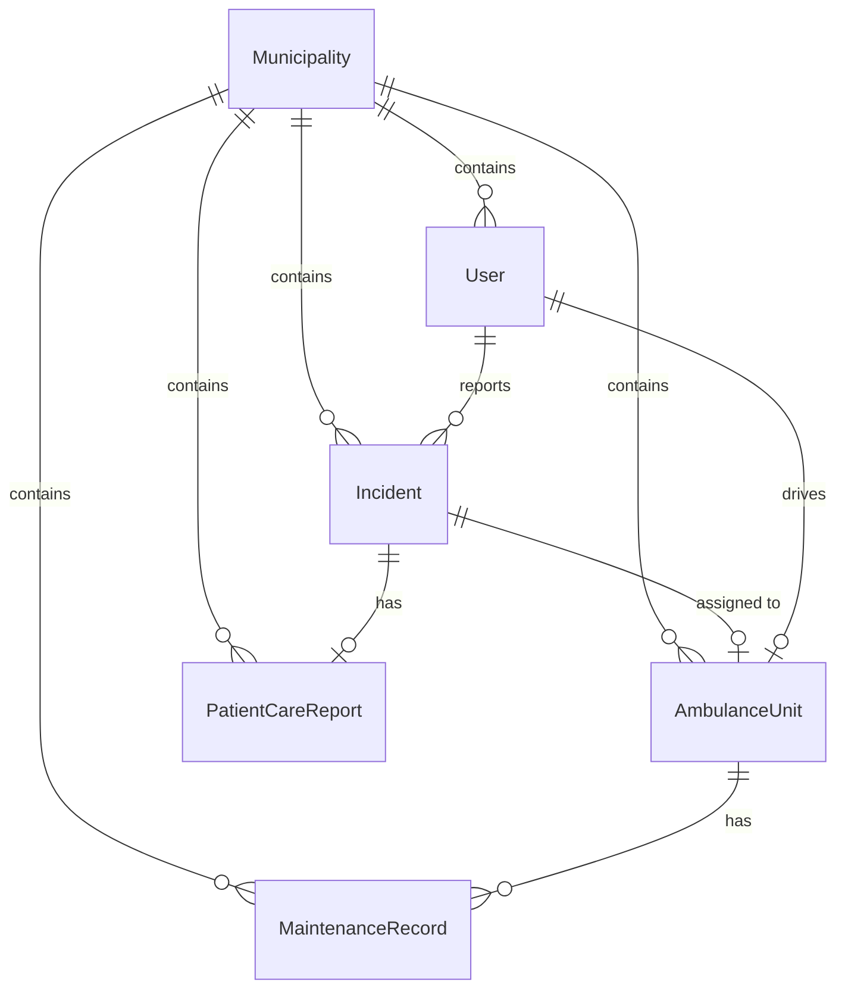

# Data Flow

## Incident Lifecycle

The core of ADMS is the **incident lifecycle** — a sequence of concrete status transitions from report to resolution.



### Step‑by‑Step

#### 1. Citizen Reports Incident

```dart
// citizen_dashboard.dart
final incident = await ref.read(incidentServiceProvider).reportIncident(
  reporterUid: user.id,
  reporterName: user.fullName,
  reporterPhone: user.phoneNumber ?? '',
  municipalityId: selectedMunicipalityId,
  latitude: position.latitude,
  longitude: position.longitude,
  address: reverseGeocodedAddress,
  severity: IncidentSeverity.critical,
  description: 'Car accident on National Highway',
);
```

**RTDB writes:**
- `/incidents/{municipalityId}/{incidentId}` — full Incident object
- `/user_incidents/{reporterUid}/{incidentId}` — `true` (citizen index)
- `/incident_index/{incidentId}` — `municipalityId` (global lookup)

#### 2. Cloud Function Auto‑Dispatch (if enabled)



#### 3. Dispatcher Views & Manages

Every active incident appears in real‑time on the Municipal Admin dashboard:

```dart
// dashboard_tab.dart
final incidentsAsync = ref.watch(municipalityIncidentsProvider(municipalityId));
```

Incidents are sorted by **severity priority** (critical first) then **newest first** (see `watchActiveIncidents`).

#### 4. Dispatcher Dispatches Unit (manual)

```dart
// dispatch map or incident detail
await ref.read(dispatchServiceProvider).dispatchUnit(
  municipalityId: muniId,
  incidentId: incId,
  unitId: bestUnit.id,
  unitCallSign: bestUnit.callSign,
  driverId: bestUnit.assignedDriverId!,
  driverName: bestUnit.assignedDriverName!,
  dispatcherUid: admin.id,
  dispatcherName: admin.fullName,
);
```

**Atomic multi‑path update:**
- `incidents/.../status → dispatched, assignedUnitId, dispatchedAt`
- `units/.../status → enRoute, currentIncidentId`

#### 5. Driver Receives Notification & Updates Status

Drivers progress through the lifecycle using the driver dashboard:

```dart
// mark en route
await dispatchService.markEnRoute(municipalityId: id, incidentId: incId, unitId: unitId);

// mark arrived on scene
await dispatchService.markArrivedAtScene(municipalityId: id, incidentId: incId, unitId: unitId);

// start transport
await dispatchService.startTransport(municipalityId: id, incidentId: incId, unitId: unitId);

// complete
await dispatchService.markTransportComplete(municipalityId: id, incidentId: incId, unitId: unitId);
```

Each method writes a **multi‑path update** that transitions both the incident and the unit, recording the precise timestamp.

#### 6. Cloud Function Frees Unit

When `status → resolved`, `onIncidentStatusChanged` fires:
- Checks the unit is still assigned to this incident (race condition guard)
- Sets `unit.status → available`, `unit.currentIncidentId → null`
- Records `resolvedAt` on the incident

## Connectivity & Offline Flow



The offline banner appears in `main.dart` via the `isOnlineProvider`, which wraps `connectivity_plus`. Firebase RTDB handles the data sync layer automatically — queued writes survive app restarts.

## Authentication Flow



## Data Model Relationships

