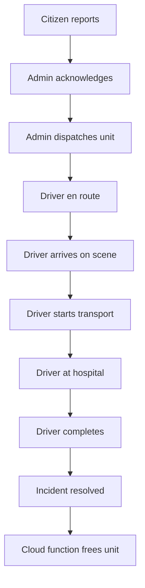
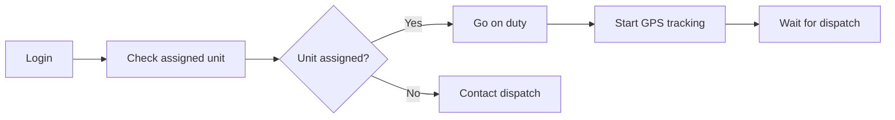
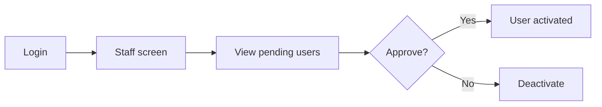

# Usage Guide

## User Roles & Their Workflows

### 🧑 Citizen

**Purpose:** Report emergencies and track ambulance arrival.

#### Report an Incident

1. Open the app and select **Citizen Login** or register as a citizen
2. Tap **Report Emergency** on the dashboard
3. Allow location access (auto‑fills your position on the map)
4. Fill in details:
   - **Incident Type** — e.g., accident, fire, cardiac
   - **Severity** — Critical / Urgent / Normal
   - **Description** — What happened, how many people involved
   - **Patient Info** — Name, age, condition (optional)
5. Tap **Submit Report**
6. Share the tracking link or track the assigned unit in real time

#### Track an Incident

- On the **Citizen Dashboard**, tap an active incident to see its live status
- The map shows the assigned unit's location (if GPS is broadcasting)
- You receive FCM notifications when the unit is dispatched

---

### 👨‍⚕️ Municipal Admin (Dispatcher)

**Purpose:** Manage incidents, dispatch units, oversee fleet operations.

#### Login & Dashboard

1. Open the web app and navigate to the staff login
2. After authentication, the **Municipal Admin Dashboard** loads
3. The dashboard shows:
   - Active incidents sorted by severity
   - Available units with status indicators
   - Quick stats (open incidents, available units, response times)

#### Acknowledge & Dispatch

1. Tap an incident card to open the detail view
2. Tap **Acknowledge** to claim the incident
3. The **Dispatch Map** shows available units with proximity ranks
4. Tap a unit and confirm **Dispatch**
5. The unit's status changes to `enRoute`, the driver receives a push notification

#### Monitor Incidents

- The **Incidents** screen shows all incidents (active + history)
- Each incident's timeline is visible with all timestamps
- Sort by severity, status, or date

#### Manage Units

- **Ambulances** screen — view, add, edit, and deactivate units
- Assign or unassign drivers to units
- View real‑time GPS positions on the dispatch map

#### Manage Staff

- **Staff** screen — view all staff in your municipality
- Approve pending driver/admin registrations
- Deactivate/reactivate accounts

#### Maintenance

- **Maintenance** screen — schedule and track fleet maintenance
- View overdue and upcoming service records
- Record completed maintenance with costs and parts

---

### 🚑 Driver / Crew

**Purpose:** Receive dispatch assignments, update mission status, complete ePCR.

#### Login & Dashboard

1. Open the mobile app and log in as a crew member
2. The dashboard shows your assigned unit and active incidents

#### Respond to an Incident

1. When a dispatch arrives (FCM notification + dashboard update), tap the incident
2. The incident detail shows location, severity, description, and a map with directions
3. Tap **Mark En Route** when you start moving
4. Tap **Arrived at Scene** when you reach the location

#### Patient Care

1. Tap **Start Transport** when the patient is loaded
2. Complete **Patient Info** fields on the incident (name, age, condition)
3. Fill out the **ePCR Form** (Electronic Patient Care Report):
   - Patient demographics
   - Chief complaint and history
   - Vital signs (BP, HR, RR, SpO2, temperature, consciousness)
   - Treatments administered
   - Medications given
4. On arrival at hospital, tap **At Hospital**
5. Enter handover details (receiving staff, notes)
6. Tap **Complete Transport** to resolve the incident

---

### 🛡️ Super Admin

**Purpose:** System‑wide configuration and oversight.

#### Dashboard

- System‑wide statistics across all municipalities
- Total incidents, active units, pending approvals

#### Municipality Management

- Create, edit, and deactivate municipalities
- Set emergency hotlines and map center coordinates

#### User Management

- View all users across the system
- Approve pending registrations for admin/driver roles
- Change user roles and municipality assignments
- Deactivate/reactivate accounts

#### System Settings

- **Auto‑Dispatch** — toggle on/off for automated nearest‑unit assignment
- **Notifications** — enable/disable push and SMS alerts
- **Admin Approval** — require approval for new accounts
- **Session Timeout** — set idle logout duration (default 60 min)
- **Response Threshold** — minutes after which response times are flagged

#### Reports & Analytics

- View aggregated response time metrics across the system
- Generate PDF/CSV reports for incidents, units, and maintenance
- View **P90 response time**, average breakdowns, and compliance rates

#### Audit Log

- Review all role changes and critical actions
- Logged automatically by Cloud Functions

---

## Common Workflows

### Full Incident Lifecycle

### Starting a Shift (Driver)

### Approving New Staff (Admin)

## Export & Reporting

From any admin screen with a list:

| Screen | Export Options |
|--------|----------------|
| **Incidents** | PDF (print dialog), CSV (download) |
| **Ambulances** | PDF, CSV |
| **Maintenance** | PDF |